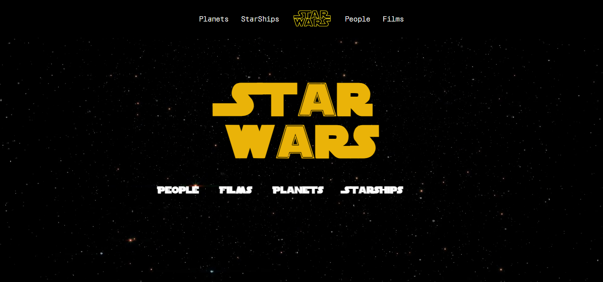
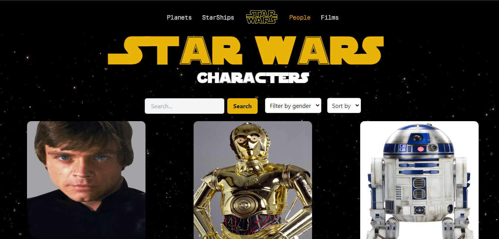
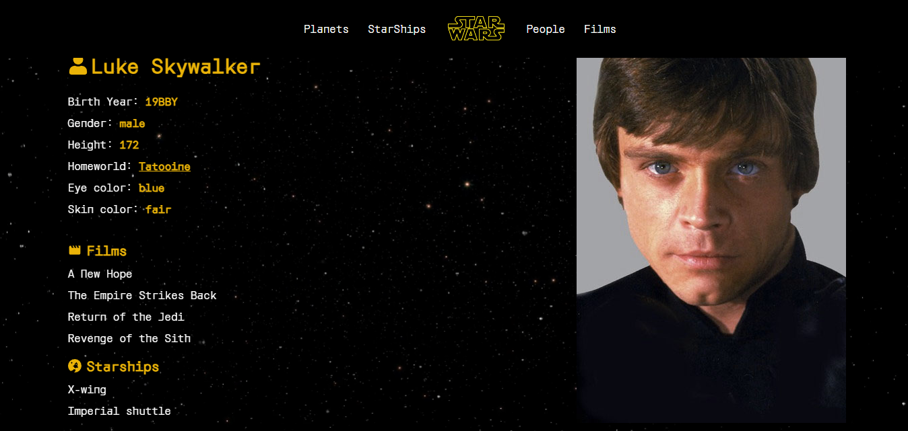
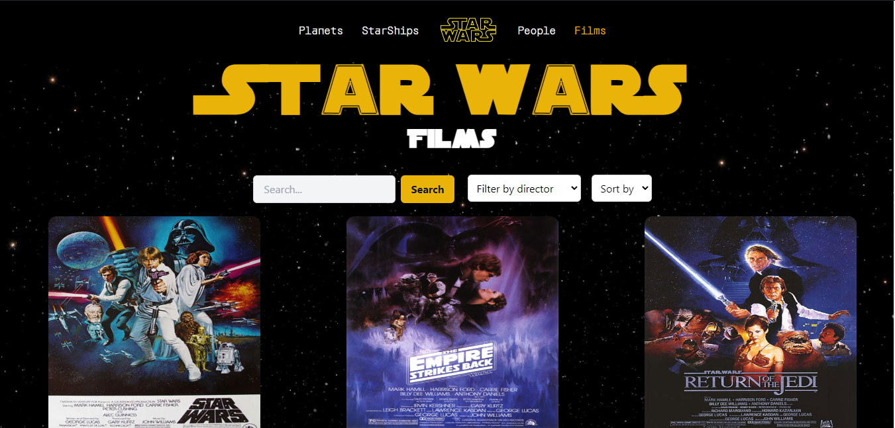
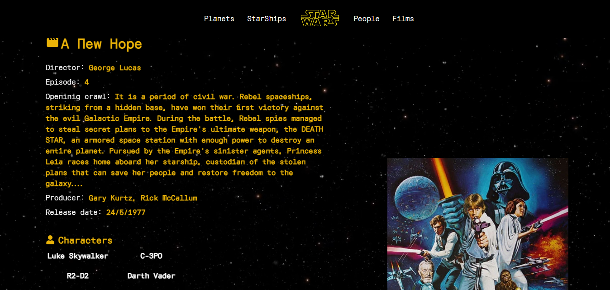
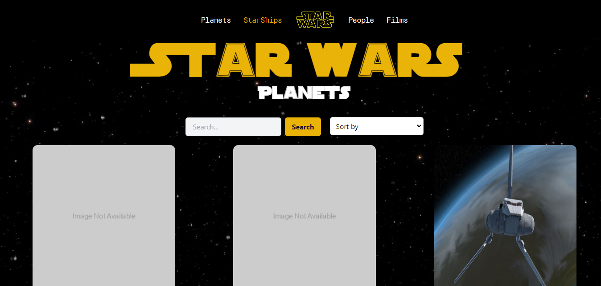
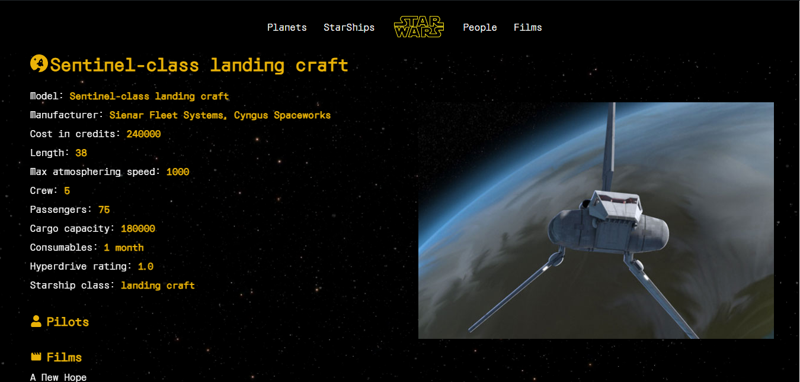
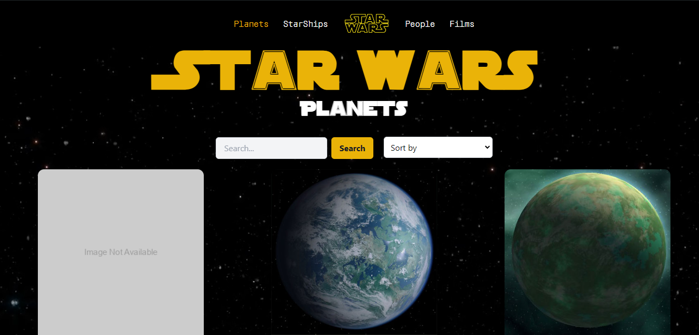
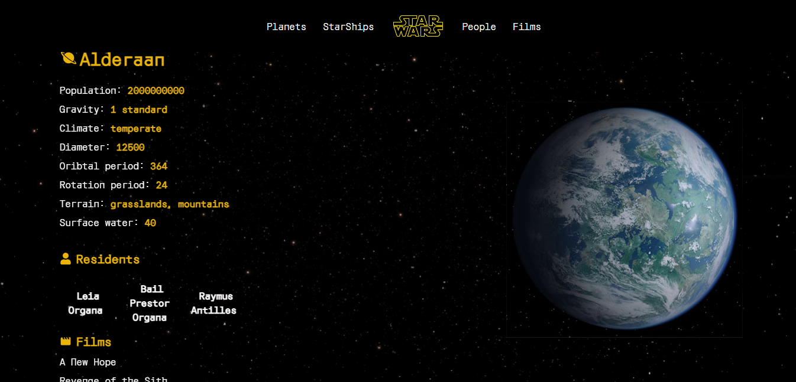
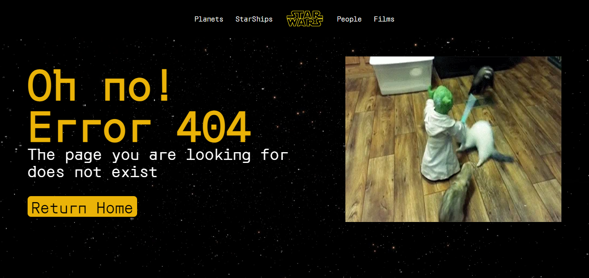

# 🚀 Challenge Fullstack: API de Star Wars

Este proyecto consiste en la implementación de una API RESTful que consume la [API de Star Wars (SWAPI)](https://swapi.dev/) y presenta sus datos a través de una interfaz web. Utiliza NodeJS para el backend, con la elección libre de herramientas adicionales, y ReactJS o NextJS para el frontend, implementando Typescript en ambos lados.

## 🎯 Objetivos

- Crear una sincronización de información que se ejecute en un cron para almacenar los datos en una base de datos MongoDB propia.
- Implementar las entidades:
  - People
  - Films
  - Starships
  - Planets
- Desarrollar endpoints para la obtención de información, permitiendo filtrar cada listado por al menos un atributo.
- Implementar tests unitarios.
- Diseñar y desarrollar una interfaz responsive que muestre la información de la API desarrollada.
- Las vistas deben incluir:
  - Listado de cada entidad.
  - Vista detallada de un elemento seleccionado de la lista.
  - Paginación y búsqueda local en los listados.

## 📋 Criterios de Evaluación

El proyecto será evaluado según los siguientes criterios:

- **Funcionalidad**: ¿La aplicación cumple con todos los puntos solicitados?
- **Calidad del Código**: ¿El código está bien estructurado, es limpio y escalable?
- **UI/UX**: ¿La interfaz de usuario es intuitiva y ofrece una buena experiencia visual?
- **Creatividad**: ¿El proyecto incluye algún componente, característica o detalle que lo destaque?
- **Testing**: ¿Se desarrollaron pruebas unitarias efectivas para el backend que verifican la funcionalidad?

## 🛠️ Tecnologías Utilizadas

- **Backend**: NodeJS
- **Frontend**: ReactJS
- **Base de Datos**: MongoDB
- **ORM/ODM**: Mongoose
- **Lenguaje**: TypeScript

## 🏗️ Project Setup

### 📚 Instala las dependencias

```bash
npm install
```

### 🚀 Ejecuta el servidor de desarrollo

```bash
npm run dev
```

### 📝 Use type-check for check type errors

```sh
npm run type-check
```

### 🧹 Use lint for lint errors

```sh
npm run lint
```

### 🧹 Use prettier fix to resolve prettier warnings

```sh
npm run prettier:fix
```

## 📸 Vistas de la Aplicación

### Home Page


### People List


### Detail View of a Person


### Films List


### Detail View of a Film


### Starships List


### Detail View of a Starship


### Planets List


### Detail View of a Planet


### 404 Error Page

